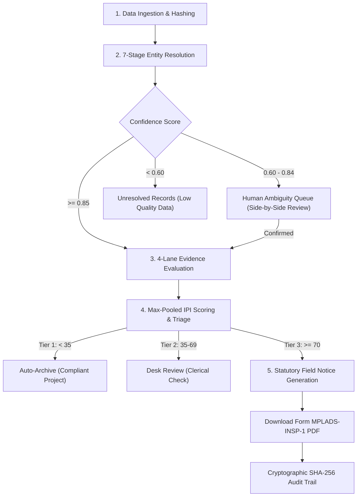

# MEEV — WORKFLOW & OPERATIONAL USER MANUAL
## SIH26102 — MPLADS Education Ecosystem Validator

> **Document Classification:** Official System User Manual & Standard Operating Procedure (SOP)  
> **Target Audience:** District Magistrates (DM), District Planning Officers (DPO), Chief Education Officers (CEO), SIH Evaluators  
> **System Version:** 1.0.0 — Production-Ready Prototype  
> **Primary District Deployment:** Kangra District, Himachal Pradesh

---

## Table of Contents
1. [System Overview & Architecture Paradigm](#1-system-overview--architecture-paradigm)
2. [Rapid Offline Installation & Launch](#2-rapid-offline-installation--launch)
3. [End-to-End Operational Lifecycle](#3-end-to-end-operational-lifecycle)
4. [Screen-by-Screen User Interface Manual](#4-screen-by-screen-user-interface-manual)
   - [4.1 Executive District Overview Dashboard](#41-executive-district-overview-dashboard)
   - [4.2 3-Tier Prioritized Investigation Queue](#42-3-tier-prioritized-investigation-queue)
   - [4.3 Split-Pane Interactive Case Explorer](#43-split-pane-interactive-case-explorer)
   - [4.4 Interactive D3.js Force-Directed Provenance Graph](#44-interactive-d3js-force-directed-provenance-graph)
   - [4.5 Human-in-the-Loop Ambiguity Resolution Queue](#45-human-in-the-loop-ambiguity-resolution-queue)
5. [Investigation Actions & Form MPLADS-INSP-1 Generation](#5-investigation-actions--form-mplads-insp-1-generation)
6. [Audit Log & Cryptographic Verification](#6-audit-log--cryptographic-verification)
7. [REST API Reference & CLI Usage](#7-rest-api-reference--cli-usage)
8. [Troubleshooting & FAQs](#8-troubleshooting--faqs)

---

## 1. System Overview & Architecture Paradigm

MEEV (**MPLADS Education Ecosystem Validator**) is an offline-capable, high-precision GovTech decision-support system designed to solve SIH26102.

### The Fundamental Problem MEEV Solves:
Existing central government portals (*e-SAKSHI*, *PFMS*, *SNA-SPARSH*) only enforce **intra-system workflow rules**—they verify whether funds were released within financial caps and whether a photographic attachment was uploaded. They **cannot** verify whether the physical classroom, laboratory, or toilet block actually materialized in the beneficiary school.

MEEV performs **Inter-System Bitemporal Functional Validation** by fusing:
- **MoSPI Fund Allocations:** e-SAKSHI project recommendations, sanction orders, disbursements, and reported completion dates.
- **Ministry of Education Annual School Census:** UDISE+ longitudinal school records (Section 1A Directory, Section 2 Physical Infrastructure, and Section 3 Student Enrollment).

```
┌─────────────────────────────────────────────────────────────────────────────┐
│                          HOW MEEV COMPUTES INTEGRITY                        │
├─────────────────────────────────────────────────────────────────────────────┤
│                                                                             │
│   e-SAKSHI (Fund Claims)                  UDISE+ (Physical Census)          │
│   • Work ID: PRJ-2023-04567               • UDISE: 02120100402 (GHS Rampur) │
│   • 2 Additional Classrooms               • Academic Year 2022-23: 7 Rooms  │
│   • Cost: ₹12.4 Lakh                      • Academic Year 2024-25: 7 Rooms  │
│   • Duration: 23 Days                                                       │
│             │                                           │                   │
│             └─────────────────────┬─────────────────────┘                   │
│                                   ▼                                         │
│                     [MEEV 4-LANE DETECTION ENGINE]                          │
│                     • Lane 1 Statutory: Eligible                            │
│                     • Lane 2 Siting: Enrollment dropped 52%                 │
│                     • Lane 3 Reflection: 0 Delta (2 Expected, 0 Counted)    │
│                     • Lane 4 Physics: 23d violates IS 456 concrete curing   │
│                                   ▼                                         │
│                     IPI Score: 82.0/100 (Tier 3 Alert)                      │
│                     Action: Auto-Generate Form MPLADS-INSP-1                │
│                                                                             │
└─────────────────────────────────────────────────────────────────────────────┘
```

---

## 2. Rapid Offline Installation & Launch

MEEV requires zero active internet access during execution.

### System Prerequisites:
- Python 3.11+
- Node.js 18+ and npm
- Windows PowerShell or Command Prompt

### Step 1: Start the Prototype
From the project root (`d:\MPLAD-watch\`), execute the automated local launcher:

```powershell
# Option A: PowerShell Launcher
.\scripts\start_meev_local.ps1
```
*or*
```cmd
:: Option B: Command Prompt Batch Launcher
.\start_meev.bat
```

### Step 2: Access the User Portals
- 🌐 **Web Dashboard:** Open your browser to [`http://localhost:3000`](http://localhost:3000)
- 📑 **FastAPI Swagger API Docs:** Open [`http://localhost:8000/docs`](http://localhost:8000/docs)
- 🩺 **Health Check:** Open [`http://localhost:8000/health`](http://localhost:8000/health)

---

## 3. End-to-End Operational Lifecycle

The operational workflow for District Planning Authorities follows 5 structured stages:



---

## 4. Screen-by-Screen User Interface Manual

### 4.1 Executive District Overview Dashboard
- **Top Header:** Displays district summary (*Kangra District, Himachal Pradesh*), total active outlay (*₹3.13 Cr across 250 works*), and district-wide average IPI score (*24.3/100*).
- **KPI Metric Cards:**
  - **Tier 3 (Red):** Mandatory Field Action cases requiring physical inspection. Clickable to instantly filter the queue.
  - **Tier 2 (Amber):** Desk Review cases with moderate data anomalies.
  - **Tier 1 (Green):** Fully reflected legitimate works.
- **Multi-Lane Systematic Anomaly Breakdown:** Summarizes occurrences across Asset Non-Reflection (Lane 3), Velocity Violations (Lane 4), Ineligible Beneficiaries (Lane 1), and Siting Inefficiencies (Lane 2).

---

### 4.2 3-Tier Prioritized Investigation Queue
- **Search Bar:** Real-time fuzzy filtering across School Names, UDISE Codes, and MPLADS Work IDs.
- **Tier Tabs:** Quickly toggle between *All Tiers*, *Tier 3 (Field Action)*, *Tier 2 (Desk Review)*, and *Tier 1 (Archived)*.
- **Table Columns:**
  - **Priority & Tier:** Displays exact IPI score (0–100) and color-coded risk badge.
  - **School & UDISE Code:** Canonical school name with 11-digit UDISE identifier.
  - **MPLADS Project:** Work ID and standardized asset taxonomy type.
  - **Sanction Cost:** Formatted in ₹ Lakhs.
  - **Anomaly Category:** Primary finding (e.g. `CRITICAL_REFLECTION_GAP`).
  - **Status:** `PENDING_REVIEW`, `ESCALATED`, `DISMISSED`, or `VERIFIED`.
- Click on any row to open the **Split-Pane Case Explorer**.

---

### 4.3 Split-Pane Interactive Case Explorer

#### Left Pane: Structured Facts & Action Controls
- **Claimed MPLADS Outlay Card:** Work ID, sanction cost, recommended date, sanction date, and completion date extracted from e-SAKSHI.
- **Bitemporal Contradiction Signals:**
  - **Lane 3 Reflection Score:** Details observed delta in classrooms vs target quantity.
  - **Lane 4 Velocity Score:** Flags civil duration violations against IS 456 concrete curing standards.
- **Statutory Action Block:**
  - **"Download Form MPLADS-INSP-1 Notice (PDF)":** Instant one-click compilation of the formal field notice.
  - **Decision Note Input:** Text field for logging investigator reasoning.
  - **"Escalate to Field Notice":** Transitions case status to `ESCALATED` and records cryptographic hash.
  - **"Dismiss":** Transitions case status to `DISMISSED` for verified administrative exceptions.

#### Right Pane: Interactive D3.js Evidence Canvas
- Renders the provenance graph representing the complete chain of evidence connecting the e-SAKSHI work, UDISE school master, longitudinal census snapshots, and contradiction nodes.

---

### 4.4 Interactive D3.js Force-Directed Provenance Graph

#### Node Color Coding & Shapes:
- 🔵 **Navy Blue (`PROJECT`):** MPLADS Project Work ID and Sanction Cost.
- 🟢 **Emerald Green (`SCHOOL`):** Master School entity and 11-digit UDISE Code.
- 🔷 **Sky Blue (`STATE`):** Annual UDISE+ census states (*2022-23 Baseline*, *2024-25 Post-Completion*).
- 🔴 **Crimson Red (`CONTRADICTION`):** Specific anomaly node (*Zero Classroom Delta*, *23-Day Velocity Violation*).
- 🟡 **Amber Yellow (`RULE`):** Statutory rule node (*MoSPI 2023 Guidelines Section 6.4*).

#### User Interactions:
1. **Zoom & Pan:** Scroll wheel zooms smoothly between $0.4\times$ and $3.0\times$. Click and drag empty space to pan across large subgraphs.
2. **Node Dragging:** Click and drag any node to reposition it; the D3 force simulation recalculates physics dynamically.
3. **Click-to-Inspect Provenance:** Click on any node to open the bottom **SHA-256 Provenance Inspector Modal**, revealing the exact raw properties and immutable cryptographic hash linking back to the government CSV record.

---

### 4.5 Human-in-the-Loop Ambiguity Resolution Queue
For projects where string matching confidence falls between $0.60$ and $0.84$, or where a school was historically renamed:
- Displays the raw project description and recorded GPS coordinates.
- Displays side-by-side candidate school cards showing distance in meters, lexical similarity score, management category, and operational status.
- Clicking **"Confirm Match"** binds the project to the selected UDISE code and immediately re-evaluates the 4 detection lanes.

---

## 5. Investigation Actions & Form MPLADS-INSP-1 Generation

When a Tier 3 case is escalated, MEEV generates a PDF statutory notice:
- **Title:** FORM MPLADS-INSP-1: DIRECTIVE FOR STATUTORY FIELD INSPECTION & MEASUREMENT
- **Statutory Authority:** Issued under Section 6.4 of the Guidelines on MPLAD Scheme 2023.
- **Directives:**
  1. Mandates Joint Physical Inspection by Executive Engineer (PWD) and District Education Officer within 14 business days.
  2. Orders physical tape measurement and structural core sample verification.
  3. Orders immediate freeze on final contractor release pending submission of Form MPLADS-INSP-2.

---

## 6. Audit Log & Cryptographic Verification

Every triage decision, status change, and ambiguity resolution is immutably logged in the `audit_log` table:

$$\text{CurrentHash}_T = \text{SHA-256}(\text{CanonicalJSON}(\text{Payload}) \parallel \text{ActorID} \parallel \text{Timestamp} \parallel \text{PreviousHash}_{T-1})$$

### Tamper-Proof Invariant:
If any past database record is modified retroactively, the hash chain breaks immediately. The automated test `test_adv_12_audit_hash_chaining_and_tamper_detection` verifies that altered entries are detected with 100% precision.

---

## 7. REST API Reference & CLI Usage

| Method | Endpoint | Description |
| :--- | :--- | :--- |
| `GET` | `/api/v1/cases` | Returns list of cases; supports `?tier=3`, `?min_ipi=70` |
| `GET` | `/api/v1/cases/{case_id}` | Full detail, lane metrics, and D3 graph payload |
| `GET` | `/api/v1/cases/{case_id}/evidence-graph` | Raw D3 node-link JSON payload |
| `GET` | `/api/v1/cases/{case_id}/notice/pdf` | Binary stream of Form MPLADS-INSP-1 PDF |
| `POST` | `/api/v1/cases/{case_id}/decision` | Submits triage decision; returns SHA-256 audit hash |
| `GET` | `/api/v1/ambiguity-queue` | Returns list of pending disambiguation items |
| `POST` | `/api/v1/ambiguity-queue/{id}/resolve` | Confirms school UDISE assignment |
| `GET` | `/api/v1/analytics/district` | Aggregate outlay and anomaly breakdown |
| `GET` | `/health` | Service health status |

---

## 8. Troubleshooting & FAQs

### Q1: What if port 8000 or 3000 is already in use?
**A:** Edit `backend/app/main.py` (port argument) and `frontend/package.json` / `.env` to specify alternative ports (e.g. 8001 / 3001).

### Q2: How do I run tests to verify system integrity?
**A:** Run the pytest verification command from `d:\MPLAD-watch\`:
```powershell
$env:PYTHONPATH="."
py -3.11 -m pytest tests/ -v
```
All 35 tests should pass in under 2 seconds.

### Q3: Why does MEEV not use an LLM for fraud detection?
**A:** LLMs hallucinate, have non-deterministic outputs, cannot be audited in court, and cannot guarantee sub-millisecond execution. MEEV uses deterministic regex taxonomy, structural civil physics (IS 456), and statistical z-scores, providing 100% mathematically reproducible evidence.
